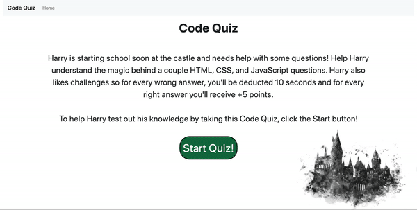

# Code Quiz

## How to use
1) Download files
2) Run index.html in browser
3) Try to get a score of 100!

## Purpose
This program asks the user to help, Harry, better understand some HTML, CSS, and Javascript questions by taking a timed quiz. As the user progresses through, any wrong answers will have a time penalty and any correct answers will award +5 points. A total of 100 points possible.  

## WIP Demo

## Project Status
The project is currently still being worked on to finish out a local storage feature as well as solving out some bugs. The program itself is for the most part functional with the exception of being able to take the high score at the end and adding audio cues. 

## Reflection
I took this on as a stepping stone to help me better understand DOM manipulation more. While this is still a work in progress, a lot of the hurdles that I came across the first time around are no longer outstanding issues so I feel like I can chalk that up as a win. Being able to add more features like audio cues for correct/wrong answers and local storage are next on my list for this project. 

[Demo of Code Quiz](https://efrenmarin45.github.io/CodeQuiz/)

No licenses. Creative purposes only. @Efrenmarin45 on GitHub.
